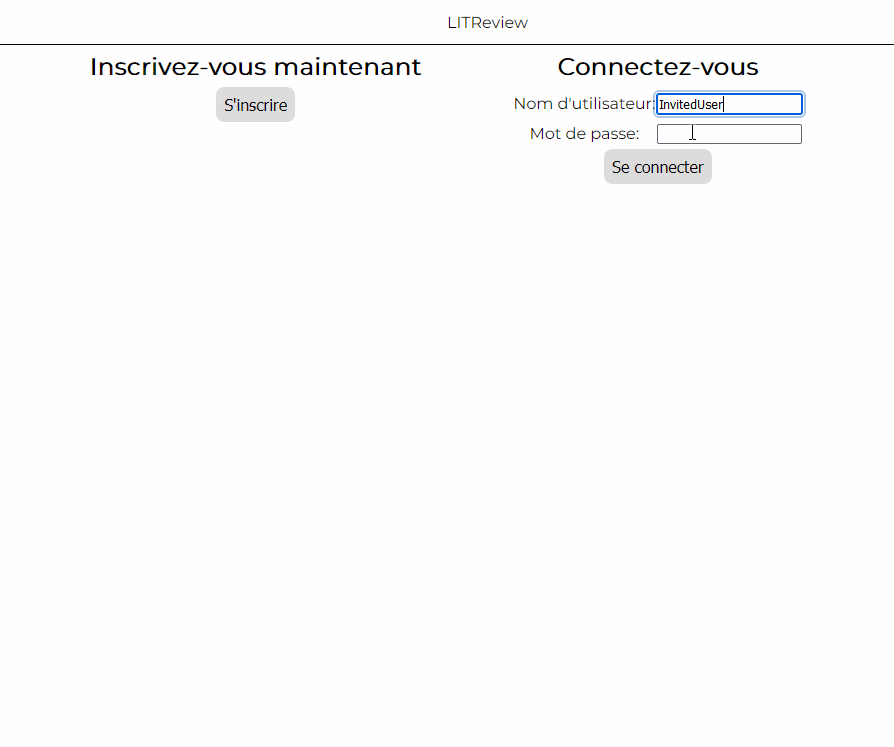
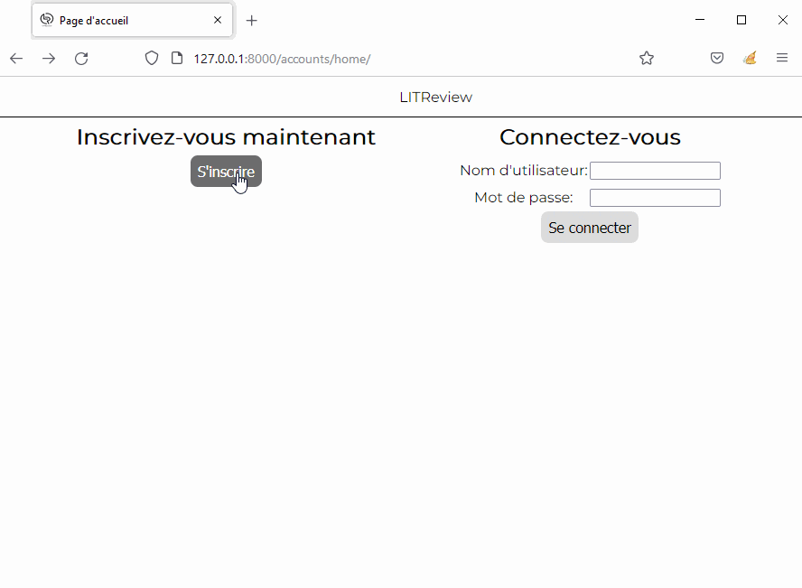
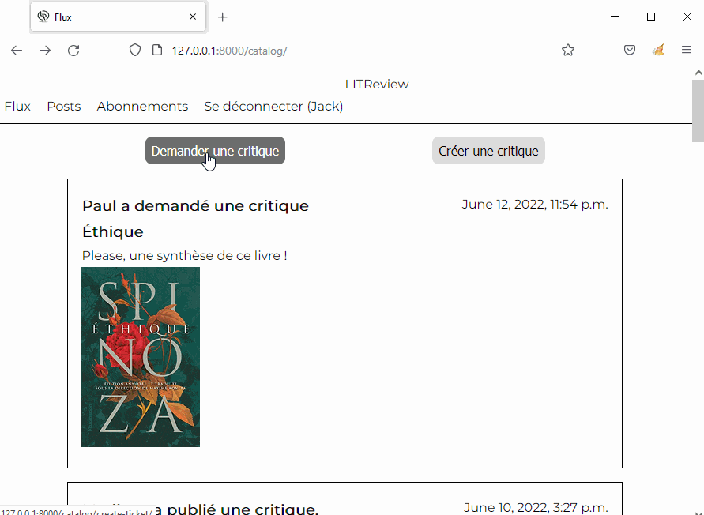
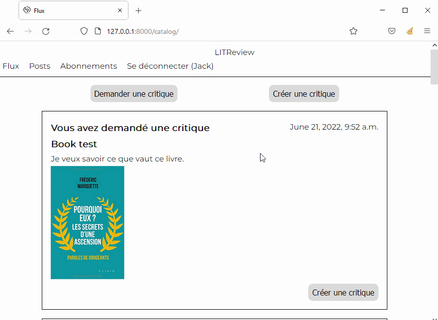

<div id="top"></div>

<!-- PROJECT LOGO -->
<br />
<div align="center">
  <a href="https://github.com/KDerec/litreview/blob/master/images/logo.png">
    
  </a>

<h3 align="center">Django Web application</h3>
  <p align="center">
    This student project is the #6 of my training.<br>You can follow the previous <a href="https://github.com/KDerec/algo-invest-trade">here</a> and next one <a href="https://github.com/KDerec/softdesk">here</a>.
  </p>
</div>


<!-- TABLE OF CONTENTS -->
<details>
  <summary>Table of Contents</summary>
  <ol>
    <li><a href="#about-the-project">About The Project</a></li>
    <li><a href="#built-with">Built With</a></li>
    <li><a href="#installation">Installation</a></li>
    <li><a href="#usage">Usage</a></li>
    <li><a href="#license">License</a></li>
    <li><a href="#contact">Contact</a></li>
  </ol>
</details>


<!-- ABOUT THE PROJECT -->
## About The Project
### 🌱 Developed skills
- Using server-side rendering in **Django**.
- Developing a web application using Django with **MVT structure** (Model-View_template).
### 🚀 Project goal
Create a **MVP** (Minimum Valuable Product) allowing a **community of users** to **consult** or **request book** and **articles reviews** on demand.  

The application is based on a requirements specifications, <a href="https://s3-eu-west-1.amazonaws.com/course.oc-static.com/projects/Python%20FR/P7%20-%20D%C3%A9veloppez%20une%20application%20Web%20en%20utilisant%20Django/LITReview%20-%20Wireframes%20-%20FR.html">wireframes</a> and a <a href="https://s3-eu-west-1.amazonaws.com/course.oc-static.com/projects/Python+EN/Python+782+Develop+a+Web+Application+Using+Django/LITReview+-+Schema.html">database schema.</a>  

<a href="https://github.com/KDerec/litreview/blob/master/images/website_in_action.gif"></a>  


<u>A user will need to:</u>
- **Log in** and **sign up** - the site should not be accessible to a non-logged-in user.
- **View a feed** containing the latest tickets and reviews from users that they follow ordered by time with the latest first.
- **Create new tickets** requesting a review on a book/article.
- **Create reviews** as a **response** to tickets.
- Create reviews **not in** response to a ticket.  As part of a one-step process, the user will create a ticket and then a review responding to their own ticket.
- Be able to **view**, **edit**, and **delete** their own **tickets** and **reviews**,
- **Follow other users** by entering their username,
- View who they follow and unfollow whoever they want. 


<u>The site will need to:</u>
- Have a **UI** matching those of the **wireframes**.
- Have a **clean** and **minimal UI**.
- Use **server-side** rendering to display information from the **database** on the page **dynamically**. 
	
<u>The codebase will need to:</u>
- Use the **Django** framework.
- Use the **Django template** language for server-side rendering.
- Use **SQLite** as a local development DB.
- Have a database design that matches the database schema and have syntax that meets **PEP8** guidelines. 


<p align="right">(<a href="#top">back to top</a>)</p>


## Built With
* [Python](https://www.python.org/)
* [Django](https://www.djangoproject.com/)
* [HTML](https://developer.mozilla.org/fr/docs/Web/HTML)
* [CSS](https://developer.mozilla.org/fr/docs/Web/CSS) 

<p align="right">(<a href="#top">back to top</a>)</p>


<!-- GETTING STARTED -->
## Installation
1. <a href="#python-installation">Install Python</a> ;
2. Clone the project in desired directory ;
   ```sh
   git clone https://github.com/KDerec/litreview.git
   ```
3. Change directory to folder ;
   ```sh
   cd path/to/litreview
   ```
4. Create a virtual environnement *(More detail to [Creating a virtual environment](https://packaging.python.org/en/latest/guides/installing-using-pip-and-virtual-environments/#creating-a-virtual-environment))* ;
    * For Windows :
      ```sh
      python -m venv env
      ```
    * For Linux :
      ```sh
      python3 -m venv env
      ```
5. Activate the virtual environment ;
    * For Windows :
      ```sh
      .\env\Scripts\activate
      ```
    * For Linux :
      ```sh
      source env/bin/activate
      ```
6. Install package of requirements.txt ;
   ```sh
   pip install -r requirements.txt
   ```

7. Change directory to project folder ;
   ```sh
   cd path/to/litreview/litreview
   ```

8. Run the server by executing the command ;
    * By default  :
      ```sh
      python manage.py runserver
      ```
    * Or for a different port, for example, 8080 :
      ```sh
      python manage.py runserver 8080
      ```

9. Open your favorite browser and go to the development server at http://127.0.0.1:8000/ by default.

10. Create an account directly with the application or use the account below ;
   ```sh
   Username: InvitedUser
   Password: Litreview01
   ```

11. Log in and enjoy the application !

<p align="right">(<a href="#top">back to top</a>)</p>


### Python installation
1. Install Python. If you are using Linux or macOS, it should be available on your system already. If you are a Windows user, you can get an installer from the Python homepage and follow the instructions to install it:
   - Go to [python.org](https://www.python.org/)
   - Under the Download section, click the link for Python "3.xxx".
   - At the bottom of the page, click the Windows Installer link to download the installer file.
   - When it has downloaded, run it.
   - On the first installer page, make sure you check the "Add Python 3.xxx to PATH" checkbox.
   - Click Install, then click Close when the installation has finished.

2. Open your command prompt (Windows) / terminal (macOS/ Linux). To check if Python is installed, enter the following command (this should return a version number.):
   ``` sh
   python -V
   # If the above fails, try:
   python3 -V
   # Or, if the "py" command is available, try:
   py -V
   ```

<p align="right">(<a href="#top">back to top</a>)</p>


<!-- USAGE EXAMPLES -->
## Usage
### **Sign up, log in & log out**
Show an example of sign up to create login, log in with the created login and logout. 

<a href="https://github.com/KDerec/litreview/blob/master/images/signup_login.gif"></a>  

### **Feed page**
Show a feed page with all tickets and reviews of books/articles from the connected user and his subscriptions.  

<a href="https://github.com/KDerec/litreview/blob/master/images/feed_page.gif"></a>  

### **Tickets creation**
Show a ticket creation with a title, description and image.  

<a href="https://github.com/KDerec/litreview/blob/master/images/ticket_creation.gif"></a>  

### **Review creation**
Show a review creation not in response to a ticket and  as a response to a ticket.  

<a href="https://github.com/KDerec/litreview/blob/master/images/review_creation.gif"></a>  

### **View, edit and delete own tickets and reviews**
Show an example of deletion and modification of ticket and review of the connected user.  

<a href="https://github.com/KDerec/litreview/blob/master/images/edit_delete_own.gif"></a>  

### **Subscription page**
Show how the user can subscribe and unsubscribe to other user and see his subscribers.  

<a href="https://github.com/KDerec/litreview/blob/master/images/subscription_page.gif"></a>  

<p align="right">(<a href="#top">back to top</a>)</p>


<!-- LICENSE -->
## License
Distributed under the MIT License. See `LICENSE` for more information.

<p align="right">(<a href="#top">back to top</a>)</p>


<!-- CONTACT -->
## Contact
Kévin Dérécusson - kevin.derecusson@outlook.fr

Project Link: [https://github.com/KDerec/litreview](https://github.com/KDerec/litreview)

<p align="right">(<a href="#top">back to top</a>)</p>


 <i>This student project is the #6 of my training.<br>You can follow the previous <a href="https://github.com/KDerec/algo-invest-trade">here</a> and next one <a href="https://github.com/KDerec/softdesk">here</a>.</i>