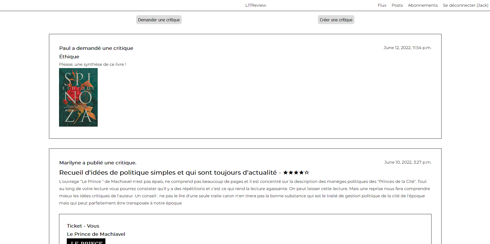

<div id="top"></div>

<!-- PROJECT LOGO -->
<br />
<div align="center">
  <a href="https://user.oc-static.com/upload/2020/09/18/16004297044411_P7.png">
    
  </a>

<h3 align="center">Develop a web application with Django</h3>

  <p align="center">
  Project to discover the Django framework by developing a web application and using server-side rendering in Django.
  </p>
</div>


<!-- TABLE OF CONTENTS -->
<details>
  <summary>Table of Contents</summary>
  <ol>
    <li>
      <a href="#about-the-project">About The Project</a>
    </li>
    <li>
      <a href="#installation">Installation</a>
      <ul>
        <li><a href="#python-installation">Python installation</a></li>
      </ul>
    </li>
    <li><a href="#usage">Usage</a></li>
    <li><a href="#license">License</a></li>
    <li><a href="#contact">Contact</a></li>
  </ol>
</details>


<!-- ABOUT THE PROJECT -->
## About The Project



Create a MVP (Minimum Valuable Product) allowing a community of users to consult or request book reviews on demand.
<br>
The application is based on a requirements specifications, a model and wireframes.

<p align="right">(<a href="#top">back to top</a>)</p>


<!-- GETTING STARTED -->

### Installation

1. <a href="#python-installation">Install Python</a> ;
2. Clone the project in desired directory ;
   ```sh
   git clone https://github.com/KDerec/litreview.git
   ```
3. Change directory to folder ;
   ```sh
   cd path/to/litreview
   ```
4. Create a virtual environnement *(More detail to [Creating a virtual environment](https://packaging.python.org/en/latest/guides/installing-using-pip-and-virtual-environments/#creating-a-virtual-environment))* ;
    * For Windows :
      ```sh
      python -m venv env
      ```
    * For Linux :
      ```sh
      python3 -m venv env
      ```
5. Activate the virtual environment ;
    * For Windows :
      ```sh
      .\env\Scripts\activate
      ```
    * For Linux :
      ```sh
      source env/bin/activate
      ```
6. Install package of requirements.txt ;
   ```sh
   pip install -r requirements.txt
   ```

7. Change directory to project folder ;
   ```sh
   cd path/to/litreview/litreview
   ```

8. Run the server by executing the command ;
    * By default  :
      ```sh
      python manage.py runserver
      ```
    * Or for a different port, for example, 8080 :
      ```sh
      python manage.py runserver 8080
      ```

9. Open your favorite browser and go to the development server at http://127.0.0.1:8000/ by default.

10. Create an account directly with the application or use the account below ;
   ```sh
   Username: InvitedUser
   Password: Litreview01
   ```

11. Log in and enjoy the application !

<p align="right">(<a href="#top">back to top</a>)</p>


#### Python installation

1. Install Python. If you are using Linux or macOS, it should be available on your system already. If you are a Windows user, you can get an installer from the Python homepage and follow the instructions to install it:
   - Go to [python.org](https://www.python.org/)
   - Under the Download section, click the link for Python "3.xxx".
   - At the bottom of the page, click the Windows Installer link to download the installer file.
   - When it has downloaded, run it.
   - On the first installer page, make sure you check the "Add Python 3.xxx to PATH" checkbox.
   - Click Install, then click Close when the installation has finished.

2. Open your command prompt (Windows) / terminal (macOS/ Linux). To check if Python is installed, enter the following command (this should return a version number.):
   ``` sh
   python -V
   # If the above fails, try:
   python3 -V
   # Or, if the "py" command is available, try:
   py -V
   ```

<p align="right">(<a href="#top">back to top</a>)</p>


<!-- USAGE EXAMPLES -->
## Usage

### Sign up, log in & log out
Show an example of sign up to create login, log in with the created login and logout.


### Feed page
Show a feed page with all tickets and reviews of books/articles from the connected user and his subscriptions.


### Tickets creation
Show a ticket creation with a title, description and image.


### Review creation
Show a review creation not in response to a ticket and  as a response to a ticket.


### View, edit and delete own tickets and reviews
Show an example of deletion and modification of ticket and review of the connected user.


### Subscription page
Show how the user can subscribe and unsubscribe to other user and see his subscribers.


<p align="right">(<a href="#top">back to top</a>)</p>


<!-- LICENSE -->
## License

Distributed under the MIT License. See `LICENSE` for more information.

<p align="right">(<a href="#top">back to top</a>)</p>


<!-- CONTACT -->
## Contact

Kévin Dérécusson - kevin.derecusson@outlook.fr

Project Link: [https://github.com/KDerec/litreview](https://github.com/KDerec/litreview)

<p align="right">(<a href="#top">back to top</a>)</p>
